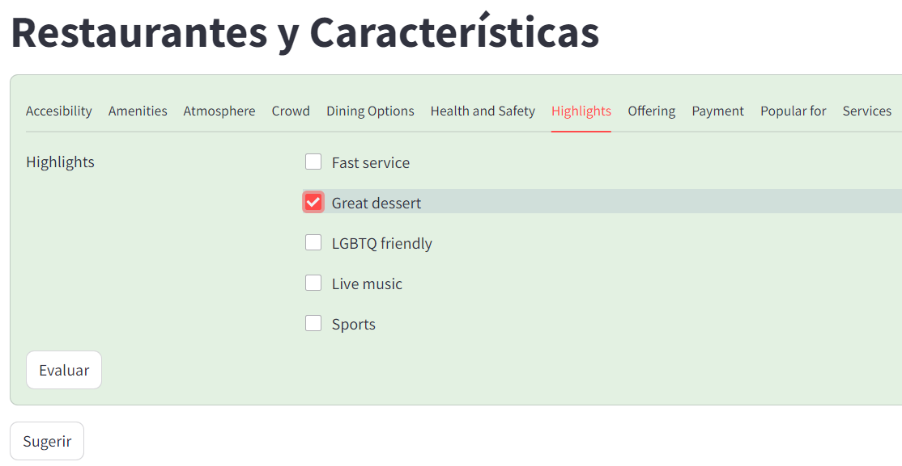

### Aprendizaje supervisado

#### Objetivo

El objetivo es tomar las características de todos los restaurantes y entrenar un modelo que pueda predecir la calificación, como negativa o positiva.
En nuestro proyecto de restaurantes Subway se utiliza este modelo para poder inferir qué atributos debemos cambiar para mejorar la calificación de negativa a positiva.

#### Preprocesamiento

Se busca el promedio de calificaciones y se establece como umbral para determinar si son positivas o negativas.
Se eligen las features consideradas más representativas y con más información disponible.
Se hace un balanceo con las salidas, para que los "sí" y los "no" tengan la misma cantidad de registros en el entrenamiento. 
#### Prueba de Regresores
Al ser un problema de clasificación dicotómica se prueba la eficiencia de diferentes algoritmos: <code>Regresión Logística, RandomForest, HistGradientBoosting, XGBClassifier, Kneighbors, GradientBoosting</code>; con diferentes escaladores: <code>StandardScaler, MaxAbsScaler, MinMaxScaler</code>.
Con el criterio de que la combinación de escalador y regresor que tenga más 75% de precisión se elige la combinación de ```XGBClassifier```y como regresor ```Standard Scaler```.

Mejores parámetros
```python
{'colsample_bytree': 0.85, 
'learning_rate': 0.05, 
'max_depth': 9, 
'n_estimators': 250, 
'subsample': 0.8}
```
Mejor cross-validation score: ```0.760407```

Mejor Precisión ```0.76```

Con esos parámetros entremanos el modelo y conseguimos:


              precision    recall  f1-score   support
         0         0.89      0.93      0.91      9672
         1         0.93      0.89      0.91      9906

Con una precisión de: 91 %


#### Implementación

Con este modelo podemos implementar una predicción, tomado un restaurante y sus características, cuáles modificar para pasar de una calificación negativa a positiva. 
Enlace: [Link Streamlit](https://ptf-restaurants-ia.streamlit.app/?id=0x8869a1416d8fd145:0x5d51304c2f5b6910)


Clicamos sugerir, esperamos unos segundos y:


Aplicando las características



Luego Evaluamos

