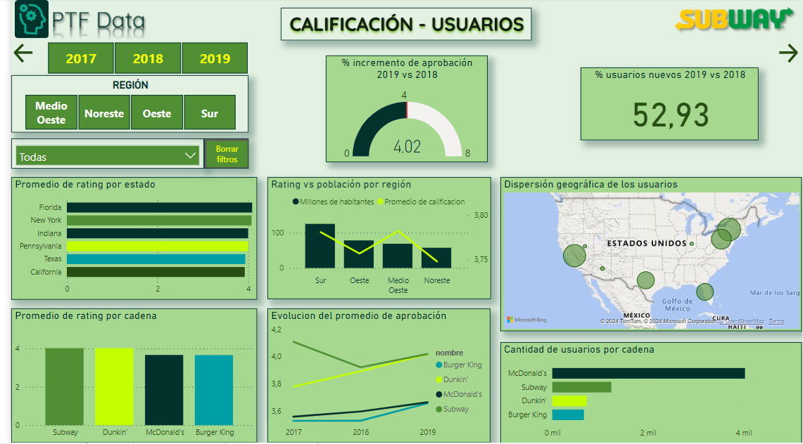

# Proyecto de Análisis de Opiniones y Recomendaciones en Yelp y Google Maps

## Descripción del Proyecto

Este proyecto se centra en el análisis de opiniones y recomendaciones de usuarios en las plataformas Yelp y Google Maps, con el objetivo de proporcionar información valiosa para la toma de decisiones estratégicas en el ámbito empresarial. Se utilizarán técnicas de procesamiento de lenguaje natural y aprendizaje automático para analizar las opiniones de los usuarios, identificar tendencias y patrones, y generar recomendaciones personalizadas.

El Cliente es un conglomerado de empresas de restaurantes y empresas afines

El público del software es tanto turistas como Restaurantes y afines

Para los análisis como el entrenamiento del modelo, se consierará un periodo de 3 años, desde el 2017 al 2019, además, se considerarán las 5 ciudades más turístics y el 20% de los restaurantes mejor puntuados, ésto aplicando la ley de paretto.

## Objetivos del Proyecto

 Recopilación y depuración de datos: Se extraerán datos de las plataformas Yelp y Google Maps, se depurarán y se almacenarán en una base de datos para su posterior análisis.

- Análisis de sentimientos: Se analizarán las opiniones de los usuarios para identificar sentimientos positivos, negativos y neutros hacia los negocios y establecimientos analizados.
- Identificación de tendencias: Se utilizarán técnicas de análisis de datos para identificar tendencias y patrones en las opiniones de los usuarios, lo que permitirá a las empresas comprender mejor las necesidades y preferencias de sus clientes.
- Desarrollo de un sistema de recomendación: Se desarrollará un sistema de recomendación basado en las opiniones de los usuarios, que permitirá a los usuarios descubrir nuevos negocios y establecimientos en función de sus preferencias y experiencias pasadas.
- Predecir los rubros con más crecimiento o decaimiento en un periodo futuro.
- Identificar puntos clave para la instalación de nuevos locales.
- Creación de un sistema de recomendación de restaurantes según gustos u otra información.
- Agregar por lo menos 1 objetivo adicional luego de analizar los datos.

## Tecnologías Utilizadas

- Python: Se utilizará Python como lenguaje de programación principal, junto con las bibliotecas Pandas, NumPy y Scikit-learn para el análisis de datos y el desarrollo de modelos de aprendizaje automático.
- SQL: Se utilizará SQL para la gestión y manipulación de la base de datos que almacenará los datos recopilados de Yelp y Google Maps.
- Herramientas de visualización: Se utilizarán herramientas de visualización de datos como Matplotlib y Seaborn para crear visualizaciones informativas y fácilmente comprensibles.
- Otras tecnologías: Se utilizarán otras tecnologías según sea necesario para el desarrollo y despliegue del proyecto.

## Entregables

- Base de datos depurada y actualizada con datos de Yelp y Google Maps.
- Informes de análisis detallados que resuman las tendencias y patrones identificados en las opiniones de los usuarios.
- Sistema de recomendación funcional que proporcione recomendaciones personalizadas a los usuarios.
- Documentación detallada que describa el proceso de recopilación de datos, análisis realizado y funcionamiento del sistema de recomendación.

## Equipo de Trabajo

Este proyecto será desarrollado por un equipo multidisciplinario de expertos en análisis de datos, aprendizaje automático y desarrollo de software. El equipo trabajará en estrecha colaboración para garantizar la entrega de un producto de alta calidad que cumpla con los objetivos del proyecto.

# Tabla de contenidos

1. [Cómo Ejecutar el Proyecto](#ejecutar)
2. [Guía de uso rápido](#usorapido)
3. [Data Analytics](#dataengineer)
   1. [Repositorio y Conjuntos de Datos](#datos)
   2. [Preprocesamiento de Datos](#preprocesamiento)
   3. [Descripción del Proyecto](#descripcion)
4. [Análisis de datos](#analisis)
5. [KPIs](#kpis)
6. [Panel de control o Dashboard](#dashboard)
7. [Modelo de Machine Learning](#machine)
8. [Presentaciones Demo](#presentacion)
9. [Contribuciones y Colaboraciones](#contribuciones)
10. [Links](#links)
11. [Licencia](#licencia)
12. [Contacto](#contacto)
13. [Menciones y agradecimientos](#menciones)

---

``

## Cómo Ejecutar el Proyecto

``

## Guía de uso rápido

``

## Data Analytics

``

### Repositorio y Conjuntos de Datos

- El repositorio original del proyecto se encuentra disponible en [GitHub](https://github.com/soyHenry/PF_DS/blob/FULL-TIME/Proyectos/yelp-goople.md).

``

### Preprocesamiento de datos

- Se realiza la carga y limpieza de los conjuntos de datos utilizando Python y las siguientes librerías:

  - numpy
  - pandas

  puedes revisar más en detalle los pasos realizados dentro del archivo [`ETL DL.ipynb`](https://github.com/Aspirina180mg/PF_DATAPT07/blob/main/ETL.ipynb) donde preparamos los datods para insertarlos en el DataLake y luego el archivo [`ETL DW.ipynb`](https://github.com/Aspirina180mg/PF_DATAPT07/blob/main/ETL.ipynb) donde se trabaja sobre los archivos del DataLake para su inserción en el DataWarehouse

``

### Descripción del Proyecto

``

## Análisis de datos

### **Análisis Monovariados**

### **Análisis Bivariados**

## Ciclo de vida de los datos

#### Adquisición de datos:

- En esta fase, se recolectan datos de diversas fuentes, como bases de datos, APIs, entre otros. Es crucial asegurar la calidad y la integridad de los datos desde su origen.

#### Limpieza y Preprocesamiento:

- Los datos adquiridos pueden contener ruido, valores faltantes o datos inconsistentes. En esta etapa, se realiza la limpieza de los datos para eliminar errores y se lleva a cabo el preprocesamiento necesario para prepararlos para su análisis posterior.

#### Almacenamiento y Gestión:

- Los datos limpios se almacenan en una infraestructura de almacenamiento adecuada, garantizando su seguridad y accesibilidad. Además, se establecen políticas de gestión de datos para administrar el acceso, la privacidad y la seguridad de los datos.

#### Análisis Exploratorio de Datos (EDA):

- En esta fase, se exploran los datos mediante técnicas estadísticas y visuales para comprender su estructura, identificar patrones y tendencias, y detectar posibles relaciones entre las variables.

#### Modelado y Procesamiento de Datos:

- Con base en los insights obtenidos durante el análisis exploratorio, se construyen modelos predictivos o descriptivos para extraer información valiosa de los datos. Se utilizan técnicas de aprendizaje automático, minería de datos u otras metodologías.

#### Interpretación y Comunicación de Resultados:

- Los resultados del análisis y del modelado se interpretan y se comunican de manera clara y efectiva a las partes interesadas. Se presentan hallazgos importantes, conclusiones y recomendaciones que puedan derivarse del estudio de los datos.

#### Implementación y Monitoreo:

- Los modelos desarrollados se implementan en entornos de producción, donde se utilizan para tomar decisiones o automatizar procesos. Se establecen mecanismos de monitoreo continuo para evaluar el rendimiento de los modelos y garantizar su actualización y mantenimiento.

#### Retención y Eliminación:

- Se definen políticas de retención de datos para determinar cuánto tiempo se conservarán los datos y en qué condiciones. También se establecen procedimientos para la eliminación segura de los datos cuando ya no sean necesarios o relevantes.

``

## KPIs

### Fórmulas

``

## Panel de datos o Dashboard

El siguiente enlace lleva al dashboard interactivo: [Dashboard](https://app.powerbi.com/view?r=eyJrIjoiZTU0NjcyMmUtODg1ZC00MWVmLTg0OGUtMmY0OTI3M2EzYjc0IiwidCI6Ijc1MDRlMzE4LThlMWUtNGQ1NS1iZmZkLTg3NWI0ZGVlODI2MCIsImMiOjR9&embedImagePlaceholder=true&pageName=c4ea6585a17c3b1d63b5)

EL archivo local se encuentra en la carpeta "Dashboard".

``
## Modelo de Machine Learning

Se puede consultar la información entregada por el modelo en el siguiente enlace: [Streamlit](https://ptf-data-subway.streamlit.app/?id=0x865681564f2dfd47:0x1f030438f1ceed23)

Al seleccionar el id de restaurante en el dropdown, luego se debe dar click al enlace para visualizar la información el nuevo restaurante seleccionado

``

## Presentaciones Demo

Habiendo tres sprints, se realizaron dos demos y una presentacion final

La [Primera Demo](https://docs.google.com/presentation/d/1kllELVOXvwlRdvCouHrlqKcEPhd5HiIF/edit#slide=id.g2e00532ecfe_0_117) consta de 16 diapositivas, donde se puede encontrar la siguiente informacion:

- diapositivias 1 a 3: presentación del equipo y contexto del proyecto
- diapositivas 4 y 5: propuestas y objetivos
- diapositiva 6: presentación de KPIs
- diapositiva 7: esquema de alcance y clientes
- diapositiva 8: esquema de un primer EDA y el estado de los datos
- diapositiva 9 y 10: primeros insights
- diapositiva 11: stack tecnólogico
- diapositiva 12 y 13: Mostración de Flujo de trabajo y presentacion dinamica Github
- diapositiva 14: Metodología de Trabajo a seguir
- diapositiva 15 y 16: finalización y saludos

La [Segunda Demo](https://docs.google.com/presentation/d/1iX4MuHME64CMS082lhlNmgBDQOiGoYiX/edit#slide=id.p2) consta de 26 diapositivas:

- diapositivas 1 a 4: mostración EDA y mockup de dashboard con primeras medidas de KPIs
- diapositivas 5 y 6: formulas de cálculo de los 4 KPIs
- diapositivas 7 y 8: introducción y primer insight de Machine Learning
- diapositiva 9: Ciclo de vida del dato
- diapositivas 10 a 14: explicacion y mostraciones del data warehouse
- diapositivas 15 a 20: explicacion y mostraciones del data lake junto con la carga incremental
- diapositiva 21: modelo de entidad/relación
- diapositivas 22 a 24: diagrama de gant y reparticion de tareas
- diapositivas 25 a 26: finalización y saludos

La [Entrega final](https://docs.google.com/presentation/d/1iX4MuHME64CMS082lhlNmgBDQOiGoYiX/edit#slide=id.p2) consta de 26 diapositivas y un [Dashboard](https://drive.google.com/file/d/1V5M6TXCvHtnHsBEfjsqwrRDfrPCzGrmn/view?usp=drive_link):

- diapositivas 1 a 4: mostración EDA y mockup de dashboard con primeras medidas de KPIs
- diapositivas 5 y 6: formulas de cálculo de los 4 KPIs
- diapositivas 7 y 8: introducción y primer insight de Machine Learning
- diapositiva 9: Ciclo de vida del dato
- diapositivas 10 a 14: explicacion y mostraciones del data warehouse
- diapositivas 15 a 20: explicacion y mostraciones del data lake junto con la carga incremental
- diapositiva 21: modelo de entidad/relación
- diapositivas 22 a 24: diagrama de gant y reparticion de tareas
- diapositivas 25 a 26: finalización y saludos
  ``

## Contribuciones y Colaboraciones

Se aceptan contribuciones al proyecto, puede enviar una solicitud de extracción (pull request) o abrir un problema (issue) en el repositorio de GitHub.

``

## Links

Proyecto Original: https://github.com/soyHenry/PF_DS/blob/FULL-TIME/Proyectos/yelp-goople.md

Repositorio: https://github.com/Aspirina180mg/PF_DATAPT07

Seguimiento de problemas: https://github.com/Aspirina180mg/PF_DATAPT07/issues

- En caso de bugs sensibles como vulnerabilidades de seguridad, por favor
  contacte directamente al correo misagtor@gmail.com en lugar de abrir un
  problema (issue), esto para agilizar el proceso de resolución.

``

## Licencia

Este proyecto se distribuye bajo la [licencia MIT](https://choosealicense.com/licenses/mit/). Consulta el archivo `LICENSE.txt` para obtener más detalles.

``

## Contacto

Para obtener más información o realizar preguntas sobre el proyecto, puedes ponerte en contacto con los miembros del equipo:

José Alcántara

- Rol: Data Analyst
- Teléfono: +51 986 564 461
- Correo Electrónico: [jalcantara777@yahoo.com](mailto:jalcantara777@yahoo.com)
- Github: [github.com/jalcantara777](https://github.com/jalcantara777)
- LinkedIn: [linkedin.com/in/jalcantara777](https://www.linkedin.com/in/jalcantara777/)

Javier Bengolea

- Rol: Data Scientist
- Teléfono: +54 935 1211 2766
- Correo Electrónico: [javierbengolea38@gmail.com](mailto:javierbengolea38@gmail.com)
- Github: [github.com/javierbengolea](https://github.com/javierbengolea)
- LinkedIn: [linkedin.com/in/javier-bengolea](https://www.linkedin.com/in/javier-bengolea/)

Lucas Colantoni

- Rol: Data Engineer
- Teléfono: +54 934 3644 7764
- Correo Electrónico: [lucascolantoni@hotmailcom](mailto:lucascolantoni@hotmailcom)
- Github: [github.com/Lcolantoni](https://github.com/Lcolantoni)
- LinkedIn: [linkedin.com/in/lucas-colantoni-39b196153](https://www.linkedin.com/in/lucas-colantoni-39b196153/)

Misael García

- Rol: Líder de Equipo y Data Engineer
- Teléfono: +56 931 854 247
- Correo Electrónico: [misagtor@gmail.com](mailto:misagtor@gmail.com)
- Github: [github.com/Aspirina180mg/](https://github.com/Aspirina180mg/)
- LinkedIn: [linkedin.com/in/mgarciat](https://linkedin.com/in/mgarciat/)

Luca Monzón

- Rol: Data Scientist
- Teléfono: +54 911 3095 0937
- Correo Electrónico: [lucamonzon2003@gmail.com](mailto:lucamonzon2003@gmail.com)
- Github: [github.com/lucamonzon2003](https://github.com/lucamonzon2003)
- LinkedIn: [linkedin.com/in/luca-monzon-94aa31238](https://www.linkedin.com/in/luca-monzon-94aa31238/)

Leonardo Morán León

- Rol: Data Scientist
- Teléfono: +59 39 7869 3382
- Correo Electrónico: [oel.espol@gmail.com](mailto:oel.espol@gmail.com)
- Github: [github.com/LeonardoMoran19](https://github.com/LeonardoMoran19/)
- LinkedIn: [linkedin.com/in/leomleon/](https://www.linkedin.com/in/leomleon/)

``

## Menciones y agradecimientos

Para la realización de este proyecto se utilizaron los conocimientos adquiridos en el Bootcamp de Data Science del Equipo de "[Henry](https://web.soyhenry.com/about-us)".
